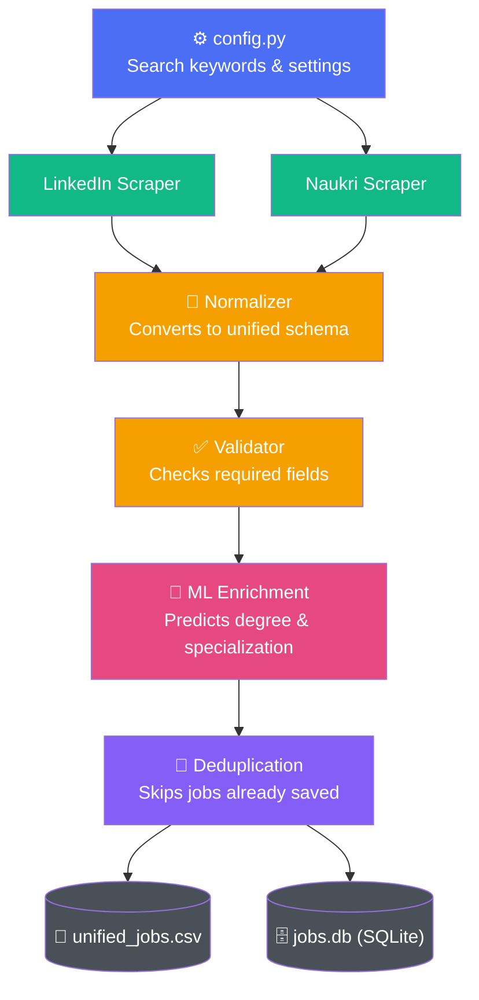

# 🕸️ Job Scraper Pipeline

A Python pipeline that scrapes job postings from **LinkedIn** and **Naukri**, cleans and normalizes them into one unified format, enriches them using **Machine Learning**, removes duplicates, and stores everything in both **CSV** and **SQLite**.

> **Goal:** Keep one clean, searchable job database — and make it easy to change what jobs you're searching for from a single file.

---

## 📚 Table of Contents

- [How It Works (Diagram)](#-how-it-works-diagram)
- [Features](#-features)
- [Project Structure](#-project-structure)
- [Output Schema](#-output-schema)
- [Requirements](#-requirements)
- [Installation](#-installation)
- [Changing Search Keywords](#-changing-search-keywords)
- [Environment Variables](#-environment-variables)
- [Running the Pipeline](#-running-the-pipeline)
- [Command-Line Options](#-command-line-options)
- [Testing & Data Quality](#-testing--data-quality)
- [SQLite Database](#-sqlite-database)
- [ML Enrichment](#-ml-enrichment)
- [Deduplication Logic](#-deduplication-logic)
- [Troubleshooting](#-troubleshooting)
- [Responsible Scraping](#-responsible-scraping)
- [License](#-license)

---

## 🖼️ How It Works (Diagram)



**In plain words:**
1. You set your job search keywords once in `config.py`.
2. The **LinkedIn** and **Naukri** scrapers collect raw job postings.
3. The **normalizer** reshapes both sources into one common 18-column format.
4. The **validator** checks that required fields (title, company, link, etc.) are present and correct.
5. **ML enrichment** fills in missing `degree_required` / `specialization_required` fields using trained models.
6. **Deduplication** makes sure a job already in your database isn't added twice.
7. Results are saved to a CSV file **and** synced into a SQLite database.

---

## ✨ Features

### 📥 Job Collection
- Scrapes jobs from **LinkedIn** and **Naukri**
- Supports multiple search keywords at once
- LinkedIn: filter by location and how recently the job was posted
- Naukri: multiple search URLs/titles, multiple pages
- Optional detail-page scraping for richer descriptions
- Limits like max jobs per keyword / max total jobs

### 🔄 Data Processing
- One unified schema for both sources
- Cleans up location, education, and experience fields
- Fills missing values with `"Not Specified"` instead of leaving blanks
- Validates job IDs and URLs

### 🤖 Machine Learning
- Predicts `degree_required` and `specialization_required` when missing
- Uses pre-trained models stored in `ml/models/`

### 💾 Storage
- `unified_jobs.csv` — easy to open in Excel/Sheets
- `jobs.db` — SQLite database for queries and other apps

### ✅ Quality Control
Built-in audit that checks for:
- Correct CSV structure (18 columns)
- Duplicate job IDs
- Missing required fields
- Invalid/contaminated location or education data
- CSV ↔ SQLite consistency

---

## 🗂️ Project Structure

```
Job_Scraper/
│
├── main.py                    # Entry point — run the whole pipeline from here
├── config.py                  # Central settings (search keywords, limits, etc.)
├── database.py                # Syncs the CSV into the SQLite database
│
├── pipeline/
│   ├── normalizer.py          # Turns raw scraped data into the unified schema
│   ├── schema.py               # Defines the unified job structure
│   ├── storage.py              # Reads/writes CSV & SQLite
│   ├── orchestrator.py         # Coordinates the full pipeline run
│   ├── enrichment.py           # Connects to the ML models
│   ├── data_quality.py         # Data audit & tests
│   └── errors.py               # Custom error types
│
├── scrapers/
│   ├── linkedin/scraper.py     # LinkedIn scraping logic
│   └── naukri/scraper.py       # Naukri scraping logic
│
├── ml/
│   ├── ml_predictor.py         # Loads models & makes predictions
│   ├── train_models.py         # (Re)train the ML models
│   └── models/                 # Saved model files (.pkl)
│
├── tests/                      # Automated tests
├── csv_output/
│   ├── unified_jobs.csv        # Generated dataset (created after first run)
│   └── jobs.db                 # Generated SQLite database (created after first run)
│
├── .env                        # Your local settings (never commit this)
├── requirements.txt            # Python dependencies
└── README.md
```

---

## 📊 Output Schema

Every job, no matter the source, is saved with these **18 columns**:

| Column | Description |
|---|---|
| `job_id` | Unique identifier for the job |
| `source` | Where it came from — `linkedin` or `naukri` |
| `title` | Job title |
| `company` | Company name |
| `category` | Job category *(currently always "Not Specified")* |
| `city` | Normalized city |
| `state` | Normalized state |
| `country` | Country |
| `min_experience_years` | Minimum experience required |
| `max_experience_years` | Maximum experience required |
| `salary` | Salary *(currently always "Not Specified")* |
| `skills` | Extracted skills |
| `degree_required` | Required degree (ML-enriched if missing) |
| `specialization_required` | Required specialization (ML-enriched if missing) |
| `posted_time` | When the job was originally posted |
| `collected_at` | When the pipeline scraped it |
| `link` | Original job posting URL |
| `full_description` | Full job description text |

> Missing values are always written as `Not Specified` — never left blank.

---

## 🧰 Requirements

- **Python 3.10+**
- **Git**
- A working **internet connection**
- A Python **virtual environment** (recommended)

Developed and tested primarily on **Windows PowerShell**.

---

## ⚙️ Installation

**1. Clone the repository**
```bash
git clone https://github.com/Pravink1005/Job_Scraper.git
cd Job_Scraper
```

**2. Create and activate a virtual environment**

Windows (PowerShell):
```powershell
python -m venv .venv
.\.venv\Scripts\Activate.ps1
```

macOS/Linux:
```bash
python -m venv .venv
source .venv/bin/activate
```

**3. Upgrade pip**
```bash
python -m pip install --upgrade pip
```

**4. Install dependencies**
```bash
pip install -r requirements.txt
```

**5. Install the browser used for scraping (if prompted)**
```bash
playwright install chromium
```

---

## 🔑 Changing Search Keywords

All keywords live in **one place** — `config.py` — and are automatically used by *both* LinkedIn and Naukri.

```python
DEFAULT_SEARCH_KEYWORDS = [
    "data analyst",
    "python developer",
    "data scientist",
    "business analyst",
]
```

After editing, just re-run the pipeline:
```bash
python main.py --source both
```

> ⚠️ Don't keep separate keyword lists anywhere else — this file is the single source of truth.

---

## 🌱 Environment Variables

Keep machine-specific or private settings in a `.env` file (never commit it). Example:

```env
PIPELINE_OUTPUT_DIR=csv_output
LINKEDIN_LOCATION=India
LINKEDIN_MAX_JOBS_PER_KEYWORD=100
LINKEDIN_JOBS_PER_PAGE=25
LINKEDIN_MAX_AGE_HOURS=1
NAUKRI_MAX_PAGES=5
NAUKRI_MAX_JOBS=100
NAUKRI_MAX_TOTAL=
NAUKRI_DELAY_SECONDS=2.0
NAUKRI_HEADLESS=true
NAUKRI_BROWSER=chromium
NAUKRI_PROFILE_DIR=
```

🚫 **Never commit:** API keys, cookies, browser session profiles, passwords, or personal tokens.

---

## ▶️ Running the Pipeline

```bash
python main.py --source both
```

This runs the full flow: **LinkedIn → Naukri → Normalize → Validate → ML Enrich → Deduplicate → CSV → SQLite**

---

## 🎛️ Command-Line Options

| Option | What it does |
|---|---|
| `--source linkedin` / `naukri` / `both` | Which source(s) to scrape |
| `--output-dir csv_output` | Where to save output files |
| `--rebuild-output` | Rebuilds the dataset (use carefully!) |
| `--no-enrichment` | Skips ML enrichment |
| `--linkedin-max-jobs 5` | Max jobs per keyword on LinkedIn |
| `--linkedin-max-age-hours 1` | Only accept LinkedIn jobs posted this recently |
| `--naukri-max-pages 5` | Max pages to scrape on Naukri |
| `--naukri-max-jobs 20` | Max jobs to collect on Naukri |
| `--naukri-headless` | Run the Naukri browser headlessly |

**Common examples:**
```bash
# LinkedIn only
python main.py --source linkedin

# Naukri only
python main.py --source naukri

# Small test run (2 jobs, last 1 hour only)
python main.py --source both --linkedin-max-jobs 2 --linkedin-max-age-hours 1

# Skip ML enrichment
python main.py --source both --no-enrichment
```

---

## 🧪 Testing & Data Quality

**Run the built-in test suite:**
```bash
python main.py --test
```

**Audit your real data** (checks structure, duplicates, missing fields, CSV/SQLite consistency):
```bash
python -m pipeline.data_quality
```

A healthy audit looks like a long list of `[PASS]` lines with `0` problems found.

---

## 🗄️ SQLite Database

The pipeline automatically syncs your CSV into `csv_output/jobs.db` at the end of every run — you normally don't need to do anything manually.

If you ever need to manually rebuild it from the CSV:
```bash
python database.py
```

Useful when: you hand-edited the CSV, the `.db` file got deleted, or the two files fall out of sync.

---

## 🤖 ML Enrichment

Located in the `ml/` folder. It predicts:
- `degree_required`
- `specialization_required`

...whenever those fields are missing, using pre-trained models in `ml/models/`. It's designed to **never overwrite** already-valid data.

To retrain or evaluate models:
```bash
python ml/train_models.py
python ml/test_production_ml.py
```

---

## 🧹 Deduplication Logic

Jobs are matched by their **job ID / URL**, not just title + company — since two different postings can share a title and company but still be separate jobs.

---

## 🛠️ Troubleshooting

| Problem | Fix |
|---|---|
| `ModuleNotFoundError` | Activate your virtual environment and run `pip install -r requirements.txt` |
| Naukri `TypeError: unexpected keyword argument` | Check the current function signature: `python -c "import inspect; from scrapers.naukri.scraper import collect_naukri_jobs; print(inspect.signature(collect_naukri_jobs))"` |
| LinkedIn shows many cards but accepts few | Normal — jobs outside your freshness window or past `--linkedin-max-jobs` are skipped |
| Deprecated "Scrapling" warning | Safe to ignore if requests still succeed (HTTP 200) |
| Naukri returns 0 jobs | Check your internet connection, whether Naukri is blocking requests, and whether selectors still match the page |
| CSV and SQLite counts don't match | Run `python -m pipeline.data_quality`, then `python database.py` if needed (back up first!) |
| Browser errors | Run `playwright install chromium` and try again |

---

## ⚖️ Responsible Scraping

This project is meant for **lawful research and personal job-search automation**. Before scraping at scale:

- ✅ Review the target site's Terms of Service
- ✅ Respect `robots.txt` and site rules
- ✅ Use reasonable request rates
- ✅ Never bypass logins or access controls
- ✅ Avoid collecting unnecessary personal data
- ✅ Keep credentials/cookies secure

Website structures change over time, so scrapers may need occasional maintenance.

---

## 📄 License

Licensed under the **MIT License** — see [LICENSE](LICENSE) for details.

---

## 👤 Author

**Pravin Kumar A.**
GitHub: [@Pravink1005](https://github.com/Pravink1005)
Project: [Job_Scraper](https://github.com/Pravink1005/Job_Scraper)